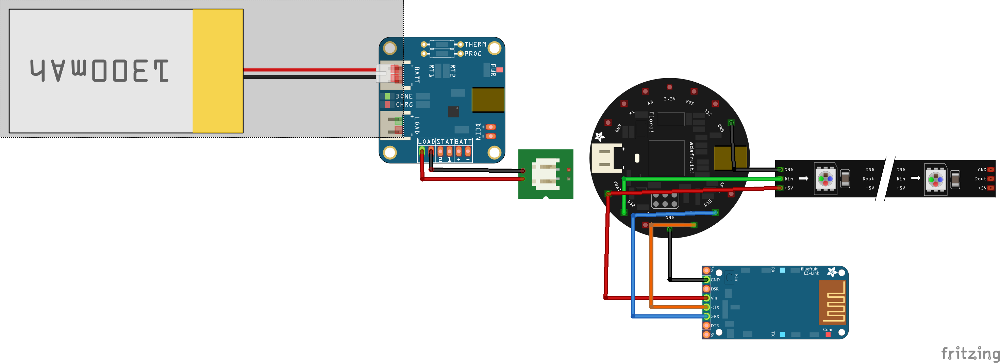

# MESSANGERbag

Connect to the bag via bluetooth and update the text scrolling on the bag.

## Parts

* [Flora](https://www.adafruit.com/product/659)
* [Neopixel Matrix](https://www.adafruit.com/product/2294)
* [Lithium Ion Battery](https://www.adafruit.com/product/328)
* [Bluefruit](https://www.adafruit.com/product/2479)
* [USB LiPoly Charger](https://www.adafruit.com/products/259)

## Wiring Diagram
* In the diagram the neopixel strip should actually be a neopixel matrix which has the same pins just on the back
* The battery is actually 2500mAh
* The wires coming off of the charger should be the included JST connector included with the charger

